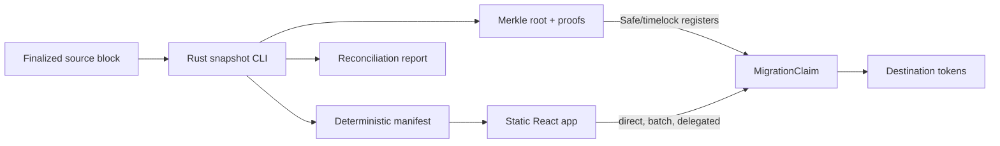

# evm-migration-lab

[](https://github.com/galo13eth/evm-migration-lab/actions/workflows/ci.yml)
[](LICENSE)

A production-minded snapshot-and-claim migration toolkit for moving ERC-721 or ERC-1155 state between EVM chains. It combines a resumable Rust snapshot generator, narrowly scoped Solidity claim contracts, and a static wallet-connected verification UI.

The design is grounded in lessons from a real Blast → Ronin migration: migrations need deterministic evidence, explicit operational authority, and a path for holders to verify the exact state being recreated.

> **This is not a trustless bridge.** A reviewed operator generates the manifest and a Safe/timelock administrator registers its Merkle root. The destination contract verifies claims against that commitment; it does not verify source-chain consensus.

## Pipeline



Each source contract/token standard is an independent campaign. The snapshot block is final: a source-chain transfer after block `N` does not change eligibility for a campaign committed at `N`.

## Quickstart

Requirements: Foundry 1.0+, Rust 1.94+, Node 24+, and GNU Make.

```bash
git clone https://github.com/galo13eth/evm-migration-lab.git
cd evm-migration-lab
make demo
```

`make demo` installs pinned dependencies, starts separate source and destination Anvil chains, deploys seeded ERC-721/1155 fixtures, runs the Rust snapshot and historical reconciliation, registers both roots, executes batch/direct/delegated claims, and asserts final balances and bitmap counts.

Focused checks:

```bash
make contracts
make rust
make app
```

## Repository

```text
contracts/          Foundry contracts, scripts, unit/fuzz/invariant tests
crates/snapshot/    Tokio + Alloy snapshot and Merkle-proof CLI
apps/web/           Vite + React verification and claim application
e2e/                Viem orchestration across two Anvil chains
fixtures/           deterministic transfer histories
docs/               architecture, threats, trust, and operator runbook
status.json         portable portfolio status artifact
```

No service is required at runtime. The web app ships the manifest/proofs as static JSON and reads claim state directly from the destination chain.

## Leaf and claim model

Leaves use OpenZeppelin-compatible double hashing and sorted pairs:

```text
bytes32 migrationId
uint256 sourceChainId
address sourceContract
uint256 snapshotBlock
uint8   standard              # 1 = ERC-721, 2 = ERC-1155
uint256 tokenId
uint256 amount
address sourceOwner
address destinationRecipient
uint256 leafIndex
```

All campaign fields are reconstructed from contract immutables. The destination recipient is committed in the leaf, duplicate claims are blocked with a root-versioned bitmap, and claim timestamps are immutable.

- `claim`: source owner submits one proof.
- `claimBatch`: source owner submits an OpenZeppelin-compatible multiproof; foreign-owner leaves revert the entire transaction.
- `claimDelegated`: any relayer submits an EIP-712 authorization checked through `SignatureChecker`, so EOAs and ERC-1271 smart accounts such as Safe are supported.

Root versions are monotonic, but each version has a fresh bitmap. This permits reviewed emergency corrections and also means the root administrator is trusted not to recreate already claimed supply.

## Snapshot CLI

```bash
cargo run --locked -p evm-snapshot -- --help
```

The CLI backfills `Transfer`, `TransferSingle`, or `TransferBatch` logs with bounded Tokio concurrency; atomically checkpoints completed chunks; rejects changed settings or a changed snapshot hash on resume; reconstructs canonically sorted holdings; and generates deterministic JSON, OpenZeppelin-compatible single proofs/owner multiproofs, and a reconciliation report. Sampled `ownerOf`/`balanceOf` reads execute at the exact snapshot block. Any mismatch fails publication.

Outputs are `manifest.json`, `proofs.json`, `root.txt`, `reconciliation.json`, `reconciliation.md`, `summary.md`, and `status.json`. The committed [status artifact](status.json) is intentionally static so a portfolio can render verified state without depending on an indexer.

## Evidence

| Layer | Automated evidence |
| --- | --- |
| Solidity | unit, 512-run fuzz, handler invariants, gas snapshot check |
| Rust | unit, integration determinism, property tests, compile-checked Criterion benchmark |
| Static analysis | Slither production-contract scan with documented triage |
| Pipeline | two-chain Anvil snapshot → reconcile → roots → direct/batch/delegated claims |
| Web | strict TypeScript build, live chain reads, receipt-based status refresh |

Representative committed gas measurements are in [`contracts/.gas-snapshot`](contracts/.gas-snapshot). CI raises fuzz/invariant depth beyond local defaults.

## Web application

The UI supports network guarding, per-wallet eligibility and bitmap status, single and owner-multiproof claims, EIP-712 signing, pasted-payload relaying, and live manifest-versus-claim reconciliation. It always displays the late-transfer and trust warning.

```bash
cp apps/web/.env.example apps/web/.env.local
npm ci --prefix apps/web
npm run dev --prefix apps/web
```

The committed deployment is an artifact preview until verified testnet addresses replace the placeholders below. Chain actions activate when `VITE_CLAIM_ADDRESS` is set.

## Trust, limitations, and operations

- [Architecture](docs/architecture.md)
- [Threat model](docs/threat-model.md)
- [Trust assumptions](docs/trust-assumptions.md)
- [Migration and Sepolia → Base Sepolia runbook](docs/migration-runbook.md)
- [Slither triage](contracts/SLITHER_TRIAGE.md)

Non-standard tokens, trustless consensus verification, ongoing bridging, relayer infrastructure, mainnet deployment, and automatic recovery from a bad root are out of scope.

## Deployments

| Network | Contract | Address | Verification |
| --- | --- | --- | --- |
| Sepolia | DemoRelicsERC-721 | pending operator deployment | pending |
| Sepolia | DemoRelicsERC-1155 | pending operator deployment | pending |
| Base Sepolia | ERC-721 MigrationClaim | pending operator deployment | pending |
| Base Sepolia | ERC-1155 MigrationClaim | pending operator deployment | pending |
| Base Sepolia | Migrated tokens | pending operator deployment | pending |

The repository intentionally remains pre-release until the funded-key deployment, explorer verification, live UI canary, and address-table update are complete. See the runbook for encrypted `cast wallet import` and Forge commands; plaintext private keys are never required.

## License

[MIT](LICENSE) © 2026 Lucas França
