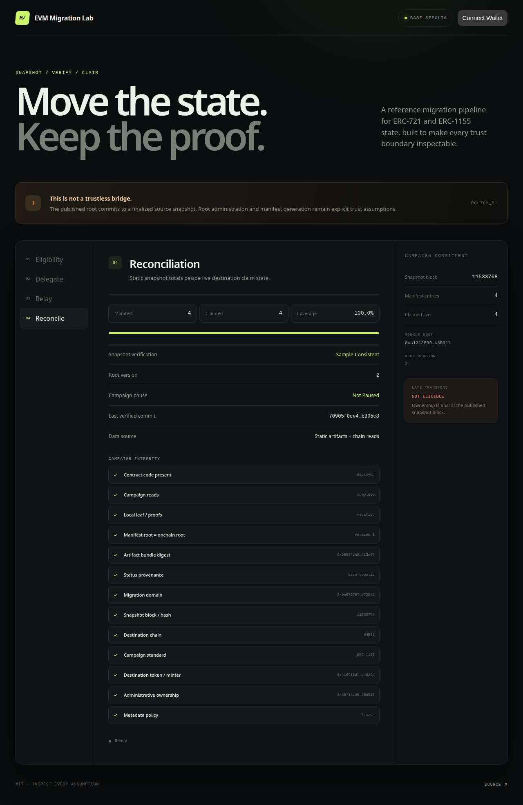
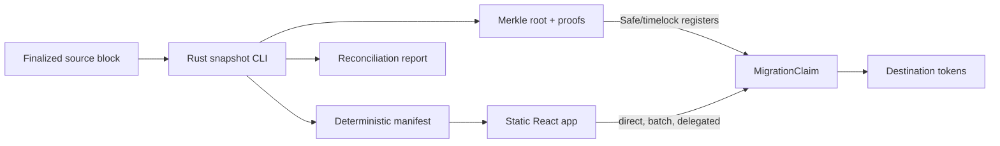

# evm-migration-lab

[](https://github.com/galo13eth/evm-migration-lab/actions/workflows/ci.yml)
[](LICENSE)

A production-minded snapshot-and-claim migration toolkit for moving ERC-721 or ERC-1155 state between EVM chains. It combines a resumable Rust snapshot generator, narrowly scoped Solidity claim contracts, and a static wallet-connected verification UI.

The design is grounded in lessons from a real Blast → Ronin migration: migrations need deterministic evidence, explicit operational authority, and a path for holders to verify the exact state being recreated.

> **This is not a trustless bridge.** A reviewed operator generates the manifest and a Safe/timelock administrator registers its Merkle root. The destination contract verifies claims against that commitment; it does not verify source-chain consensus.

[](https://web-production-fab71.up.railway.app/)

## Pipeline



Each source contract/token standard is an independent campaign. The snapshot block is final: a source-chain transfer after block `N` does not change eligibility for a campaign committed at `N`.

## Quickstart

Requirements: Foundry 1.0+, Rust 1.94+, Node 24+, and GNU Make.

```bash
git clone https://github.com/galo13eth/evm-migration-lab.git
cd evm-migration-lab
make demo
```

`make demo` installs pinned dependencies, starts separate source and destination Anvil chains, deploys seeded ERC-721/1155 fixtures, runs the Rust snapshot and historical reconciliation, registers both roots, executes batch/direct/delegated claims, and asserts final balances and bitmap counts.

Focused checks:

```bash
make contracts
make rust
make app
```

## Repository

```text
contracts/          Foundry contracts, scripts, unit/fuzz/invariant tests
crates/snapshot/    Tokio + Alloy snapshot and Merkle-proof CLI
apps/web/           Vite + React verification and claim application
e2e/                Viem orchestration across two Anvil chains
fixtures/           deterministic transfer histories
docs/               architecture, threats, trust, and operator runbook
status.json         portable portfolio status artifact
SECURITY.md         private vulnerability-reporting policy
```

No service is required at runtime. The web app ships the manifest/proofs as static JSON and reads claim state directly from the destination chain.

## Start here when reviewing

- [`MigrationClaimBase.sol`](contracts/src/MigrationClaimBase.sol) and the typed [`ERC721MigrationClaim`](contracts/src/ERC721MigrationClaim.sol) / [`ERC1155MigrationClaim`](contracts/src/ERC1155MigrationClaim.sol) contracts
- [`rpc.rs`](crates/snapshot/src/rpc.rs) and source-chain [`authorization.rs`](crates/snapshot/src/authorization.rs)
- [`pipeline.ts`](e2e/pipeline.ts), including the source-only ERC-1271 wallet case
- [`threat-model.md`](docs/threat-model.md) and the operator [`migration-runbook.md`](docs/migration-runbook.md)
- The public [`Sepolia → Base Sepolia canary`](docs/canary-sepolia-base-sepolia.md) and committed [`artifact bundles`](artifacts/sepolia-base-sepolia)

## Leaf and claim model

Leaves use OpenZeppelin-compatible double hashing and sorted pairs:

```text
bytes32 migrationId
uint256 sourceChainId
address sourceContract
uint256 snapshotBlock
bytes32 sourceBlockHash
uint256 destinationChainId
uint8   standard              # immutable: 1 = ERC-721, 2 = ERC-1155
uint256 tokenId
uint256 amount
address sourceOwner
address claimAuthority
address destinationRecipient
uint256 leafIndex
```

All campaign fields are reconstructed from contract immutables. Each campaign can mint exactly one standard through exactly one permanently locked destination token. The destination recipient is committed in the leaf and duplicate claims are blocked globally by leaf index. The claim window—not individual transaction timestamps—is immutable.

- `claim`: the committed destination `claimAuthority` submits one proof.
- `claimBatch`: one authority submits an OpenZeppelin-compatible multiproof; foreign-authority leaves revert the entire transaction.
- `claimDelegated`: any relayer submits a root/version-bound EIP-712 authorization checked through `SignatureChecker`.

An EOA owner needs no mapping. A source contract owner must provide an explicit migration authorization or snapshot generation fails; the CLI validates ERC-1271 at the snapshot block and commits its destination authority. Destination delegated claims support EOAs and ERC-1271 accounts deployed and valid on the destination chain.

Roots may be corrected only before `claimStart` and before any claim. Once launch begins, the root is permanently frozen; a post-launch incident requires a documented redeployment.

## Snapshot CLI

```bash
cargo run --locked -p evm-snapshot -- --help
```

The CLI backfills `Transfer`, `TransferSingle`, or `TransferBatch` logs with bounded Tokio concurrency; atomically checkpoints completed chunks; rejects changed settings or a changed snapshot hash on resume; reconstructs canonically sorted holdings; and generates deterministic JSON, OpenZeppelin-compatible single proofs/authority multiproofs, and a reconciliation report. Sampled `ownerOf`/`balanceOf` reads execute at the exact snapshot block. The boundary hash is checked before logs, after logs, and again after reconciliation. Any mismatch fails publication.

Successful outputs are published together under `output/runs/<bundle-digest>/`, terminated by `READY`, with `current.json` switched only after every file is complete. `artifact-digests.json` commits the reviewed manifest, proofs, root, reconciliation, and summary. Reconciliation is reported as `sample-consistent`, never as proof that an RPC omitted no holdings. The committed [status artifact](status.json) remains static so a portfolio can render state without an indexer.

Generate the campaign independently through two archive providers, then gate publication on byte-identical committed artifacts:

```bash
./scripts/compare-snapshot-bundles.sh output-a/runs/<digest> output-b/runs/<digest>
```

## Evidence

| Layer | Automated evidence |
| --- | --- |
| Solidity | unit, 512-run fuzz, handler invariants, gas snapshot check |
| Rust | unit, integration determinism, property tests, compile-checked Criterion benchmark, RustSec audit |
| Static analysis | zero-finding Slither production-contract scan with source-scoped triage |
| Pipeline | two-chain Anvil snapshot → reconcile → roots → direct/batch/delegated claims |
| Web | runtime artifact validation, leaf/proof verification, fail-closed chain checks, Vitest/RTL, Playwright, strict build |

Representative committed gas measurements are in [`contracts/.gas-snapshot`](contracts/.gas-snapshot). CI raises fuzz/invariant depth beyond local defaults.

| Claim operation | Gas |
| --- | ---: |
| Single ERC-1155 | 91,830 |
| 5-leaf multiproof batch | 145,346 |
| 20-leaf multiproof batch | 340,007 |
| Delegated EOA | 119,928 |
| Delegated ERC-1271 | 121,511 |

## Web application

The UI validates static JSON at runtime, recomputes leaf hashes and proofs, reads every campaign commitment plus token/minter state, and disables claims/signing on any mismatch. It also supports network guarding, authority eligibility, single and multiproof claims, root/version-bound EIP-712 signing, connected-wallet relaying, decoded contract errors, explorer links, and live reconciliation.

[Open the live Base Sepolia verification and claim application](https://web-production-fab71.up.railway.app/).

```bash
cp apps/web/.env.example apps/web/.env.local
npm ci --prefix apps/web
npm run dev --prefix apps/web
```

The hosted application serves the reviewed ERC-1155 version-2 artifact bundle and reads the live Base Sepolia claim contract. Claim actions remain disabled unless every artifact, proof, campaign immutable, root version, minter, and onchain state check passes.

## Public testnet canary

The release canary snapshots Sepolia block `11533768` (`0xa6472000…3ff2c`) and recreates the fixtures on Base Sepolia. Both campaign bundles were generated independently through two RPC providers, compared byte-for-byte, fully sampled against historical contract reads, and registered by a 2-of-3 Safe.

| Campaign | Root version | Merkle root | Artifact digest | Artifacts |
| --- | ---: | --- | --- | --- |
| ERC-721 | 1 | `0x7f4f4d5e…217eb` | `0x786dcd69…a96c2` | [`erc721/`](artifacts/sepolia-base-sepolia/erc721) |
| ERC-1155 | 2 | `0xc1312899…3591f` | `0x969241e6…13e86` | [`erc1155/`](artifacts/sepolia-base-sepolia/erc1155) |

ERC-1155 version 2 is a disclosed pre-launch, zero-claim correction; the [old bundle and machine-readable diff](artifacts/sepolia-base-sepolia/erc1155/root-correction-v1-to-v2.json) remain public. The claim window is `2026-08-21 06:07:58 UTC` through `2026-09-20 06:07:58 UTC`. Direct, multiproof batch, delegated EOA, destination ERC-1271, source-only ERC-1271 authorization, pause/resume, and failure-path evidence is recorded in the [canary report](docs/canary-sepolia-base-sepolia.md).

## Trust, limitations, and operations

- [Architecture](docs/architecture.md)
- [Threat model](docs/threat-model.md)
- [Trust assumptions](docs/trust-assumptions.md)
- [Migration and Sepolia → Base Sepolia runbook](docs/migration-runbook.md)
- [Slither triage](contracts/SLITHER_TRIAGE.md)
- [Security policy](SECURITY.md)
- [Changelog](CHANGELOG.md)

Non-standard tokens, trustless consensus verification, ongoing bridging, relayer infrastructure, mainnet deployment, and automatic recovery from a bad root are out of scope.

## Deployments

| Network | Contract | Address | Verification |
| --- | --- | --- | --- |
| Sepolia | DemoSourceWallet | [`0xAA449F…C5E8`](https://sepolia.etherscan.io/address/0xAA449Fb72Fc8B4989acB5287787660Af5d19C5E8#code) | Etherscan verified |
| Sepolia | DemoRelics721 | [`0x6c6b42…F1D9`](https://sepolia.etherscan.io/address/0x6c6b4275F4429a2825c3c85a4c4430d23FaBF1D9#code) | Etherscan verified |
| Sepolia | DemoRelics1155 | [`0x323643…CeBB`](https://sepolia.etherscan.io/address/0x323643Af1A28cF70Ffd31F896c083d15Ba90CeBB#code) | Etherscan verified |
| Base Sepolia | 2-of-3 Safe | [`0x3B7141…8517`](https://sepolia.basescan.org/address/0x3B71419690766083c576eF109FAab4f4b99B8517) | Safe v1.4.1 proxy |
| Base Sepolia | Destination ERC-1271 wallet | [`0x0d2848…EE90`](https://sepolia.basescan.org/address/0x0d2848a72fdd385aF3fdaC11b9bEaE8E7cb3EE90#code) | BaseScan verified |
| Base Sepolia | ERC721MigrationClaim | [`0x422FE0…8ae5`](https://sepolia.basescan.org/address/0x422FE0B8f0E2e1381F04F920840c88F9A0718ae5#code) | BaseScan verified |
| Base Sepolia | MigratedERC721 | [`0x417513…25b7`](https://sepolia.basescan.org/address/0x417513ddD2087C93B4414718ED803781A81D25b7#code) | BaseScan verified |
| Base Sepolia | ERC1155MigrationClaim | [`0xe5325f…7137`](https://sepolia.basescan.org/address/0xe5325f772402ff0FF1a17fF984dd813891ac7137#code) | BaseScan verified |
| Base Sepolia | MigratedERC1155 | [`0x416986…829d`](https://sepolia.basescan.org/address/0x416986df24d1391Ef311C93713F2d242E7c4829d#code) | BaseScan verified |

Deployment used encrypted Foundry keystores and separate Safe approvals; plaintext private keys were never stored in the repository or environment files.

## License

[MIT](LICENSE) © 2026 Lucas França
