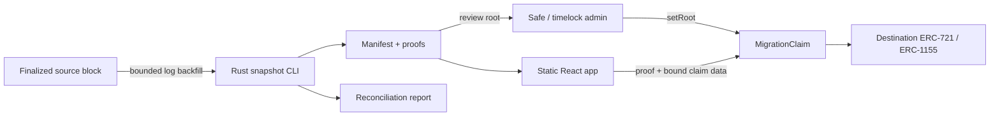

# Architecture

`evm-migration-lab` is a snapshot-and-claim state migration system. It is not a bridge: no source-chain event is relayed or verified by the destination contract. A reviewed manifest and its Merkle root are the handoff between chains.



## Campaign boundary

One typed claim contract represents one source contract and one token standard at one snapshot block. `ERC721MigrationClaim` and `ERC1155MigrationClaim` each hold only one destination token and one mint path. The Rust CLI likewise processes one source contract/standard per invocation. A collection with both standards uses two campaigns.

The contract makes these campaign values immutable:

- `migrationId`
- `sourceChainId`
- `sourceContract`
- `snapshotBlock`
- `sourceBlockHash`
- `destinationChainId`
- one destination token address and token standard
- `claimStart` and `claimDeadline`

## Leaf encoding

Leaves use the OpenZeppelin `StandardMerkleTree` convention: ABI-encode the values, hash once, concatenate the 32-byte hash, and hash again. Pairs are sorted by the Merkle implementation.

```text
keccak256(bytes.concat(keccak256(abi.encode(
  bytes32 migrationId,
  uint256 sourceChainId,
  address sourceContract,
  uint256 snapshotBlock,
  bytes32 sourceBlockHash,
  uint256 destinationChainId,
  uint8 standard,
  uint256 tokenId,
  uint256 amount,
  address sourceOwner,
  address claimAuthority,
  address destinationRecipient,
  uint256 leafIndex
))))
```

Historical ownership, destination authority, and destination recipient are separate commitments. EOAs normally use the same address for all three. A source-only smart wallet signs a source-chain authorization that the CLI validates at the snapshot block before committing a destination authority. `leafIndex` is the global bitmap key.

## Contract state and calls

Claims use one global `BitMaps.BitMap`; `claimedCount()` is cumulative and `isClaimed(index)` cannot reset across a correction. Root versions remain observable, but `setRoot` works only before `claimStart`, before any claim, and only for a changed root with a new artifact digest. The root is frozen at launch.

The claim contract uses `nonReentrant`. Signature validation occurs before nonce/bitmap mutation; claim state is then marked before token minting. ERC-721 uses `_mint` to reproduce historical contract ownership even when a recipient lacks `ERC721Receiver`. Destination tokens permanently lock their minter and can permanently freeze metadata.

Direct and batch claims require every `claimAuthority` to equal `msg.sender`. Delegated claims use OpenZeppelin `SignatureChecker`, covering EOAs and destination-deployed ERC-1271 accounts, with this EIP-712 payload:

```text
DelegatedClaim(bytes32 leafHash,bytes32 merkleRoot,uint64 rootVersion,address destinationRecipient,uint256 nonce,uint256 deadline)
```

The EIP-712 domain is `EVM Migration Claim`, version `2`, destination chain ID, and the claim contract address. Binding both root and version invalidates unused signatures when a pre-launch correction occurs.

## Snapshot pipeline

The Rust CLI uses Alloy to fetch logs and historical reads. It splits the requested block range into deterministic chunks, runs a bounded number concurrently, and atomically checkpoints completed chunks. A resumed run must match every checkpoint setting and the snapshot block hash.

Transfer events are ordered by block, transaction, log, and batch sub-index before state reconstruction. Holdings are canonically sorted before leaf indices are assigned. Serde pretty JSON with a trailing newline makes repeated output byte-stable. `merkrs` supplies OpenZeppelin-compatible roots, single proofs, and owner multiproofs.

Before publishing, the CLI reads the snapshot block hash again, samples `ownerOf` or `balanceOf` at that exact block, and checks the boundary once more after those historical calls. A changed boundary or sample mismatch is a hard failure. Files are staged and atomically published under their bundle digest with per-file Keccak digests and a final `READY` marker.

## Alternatives rejected

- A cross-chain messaging bridge: wrong trust and operating model for a one-time state migration.
- One combined multi-contract manifest: larger review and failure blast radius.
- Caller-selected recipients: easier UX, but weakens reviewability and enables signature redirection mistakes.
- Custom Merkle construction: unnecessary security surface; `merkrs` and OpenZeppelin are backed by cross-language differential checks rather than an unsupported audit claim.
- A hosted indexing backend: static artifacts plus destination reads are sufficient for the reference UI.
