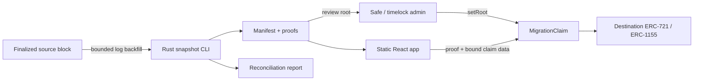

# Architecture

`evm-migration-lab` is a snapshot-and-claim state migration system. It is not a bridge: no source-chain event is relayed or verified by the destination contract. A reviewed manifest and its Merkle root are the handoff between chains.



## Campaign boundary

One `MigrationClaim` represents one source contract and one token standard at one snapshot block. The Rust CLI likewise processes one source contract/standard per invocation. A collection with both standards uses two campaigns. This keeps log decoding, reconciliation, manifest review, and root rotation independently auditable.

The contract makes these campaign values immutable:

- `migrationId`
- `sourceChainId`
- `sourceContract`
- `snapshotBlock`
- destination ERC-721 and ERC-1155 token addresses
- `claimStart` and `claimDeadline`

## Leaf encoding

Leaves use the OpenZeppelin `StandardMerkleTree` convention: ABI-encode the values, hash once, concatenate the 32-byte hash, and hash again. Pairs are sorted by the Merkle implementation.

```text
keccak256(bytes.concat(keccak256(abi.encode(
  bytes32 migrationId,
  uint256 sourceChainId,
  address sourceContract,
  uint256 snapshotBlock,
  uint8 standard,
  uint256 tokenId,
  uint256 amount,
  address sourceOwner,
  address destinationRecipient,
  uint256 leafIndex
))))
```

The destination recipient is fixed in the reviewed manifest; callers cannot redirect a claim. `leafIndex` is the bitmap key and is included in the commitment.

## Contract state and calls

Claims are stored as `mapping(uint64 => BitMaps.BitMap)`, keyed first by root version. `claimedCount()` reports the current version and `isClaimed(version,index)` supports historical reconciliation. A root update must strictly increase the version and starts a fresh bitmap namespace; this is powerful trusted administration, not a recovery-free upgrade.

The claim contract follows checks-effects-interactions and uses `nonReentrant`. State is marked before the only external interactions: mint receiver callbacks and ERC-1271 signature validation. Destination tokens permanently lock their minter to the campaign after deployment.

Direct and batch claims require every `sourceOwner` to equal `msg.sender`. Delegated claims use OpenZeppelin `SignatureChecker`, covering EOAs and ERC-1271 accounts, with this EIP-712 payload:

```text
DelegatedClaim(bytes32 leafHash,address recipient,uint256 nonce,uint256 deadline)
```

The EIP-712 domain is `EVM Migration Claim`, version `1`, destination chain ID, and the claim contract address. The leaf additionally binds the source domain and campaign.

## Snapshot pipeline

The Rust CLI uses Alloy to fetch logs and historical reads. It splits the requested block range into deterministic chunks, runs a bounded number concurrently, and atomically checkpoints completed chunks. A resumed run must match every checkpoint setting and the snapshot block hash.

Transfer events are ordered by block, transaction, log, and batch sub-index before state reconstruction. Holdings are canonically sorted before leaf indices are assigned. Serde pretty JSON with a trailing newline makes repeated output byte-stable. `merkrs` supplies OpenZeppelin-compatible roots, single proofs, and owner multiproofs.

Before publishing, the CLI reads the snapshot block hash again and samples `ownerOf` or `balanceOf` at that exact block. A changed boundary or reconciliation mismatch is a hard failure.

## Alternatives rejected

- A cross-chain messaging bridge: wrong trust and operating model for a one-time state migration.
- One combined multi-contract manifest: larger review and failure blast radius.
- Caller-selected recipients: easier UX, but weakens reviewability and enables signature redirection mistakes.
- Custom Merkle code: unnecessary security surface; use compatible audited libraries on both sides.
- A hosted indexing backend: static artifacts plus destination reads are sufficient for the reference UI.
